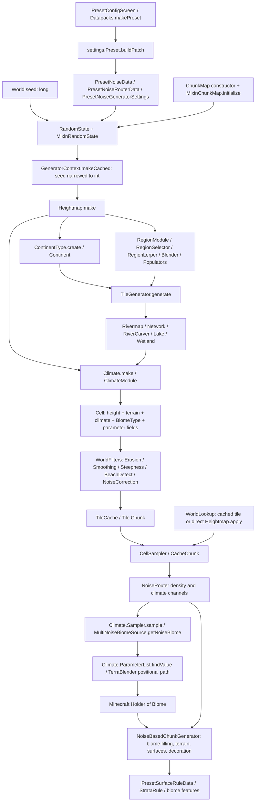
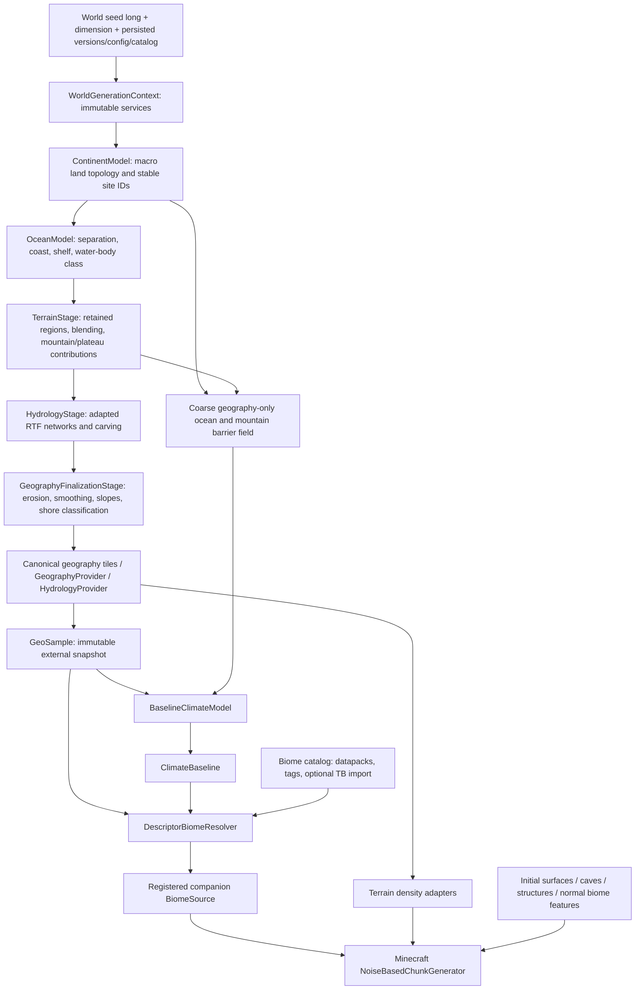

# Phase 1 architecture audit

Audit date: 2026-09-05. Source baseline: `e7bc3e0128e240bb77ec201f2c7e6190ac817652`.

This is a source audit and proposed migration, not an implemented generator. Generation code was not changed during this pass. The dependency-ordered implementation and acceptance criteria are in [PHASE_1_IMPLEMENTATION_PLAN.md](PHASE_1_IMPLEMENTATION_PLAN.md).

## 1. Findings that determine the architecture

The reusable foundation is the composable noise graph, regional terrain populators, river carving, batched tiles, and initial surface machinery. The replacement boundary must include **climate authority and the final Minecraft biome source**, not just the class named `Climate`.

The current code has five especially consequential properties:

1. [Heightmap] owns continent construction, terrain composition, river application, climate construction/application, and Minecraft erosion/weirdness parameter corrections. [ClimateModule] also changes terrain classification. Moving climate out without relocating those geography writes changes terrain behavior.
2. [TileGenerator] calculates climate before [WorldFilters] erodes and smooths heights. The new baseline climate must consume finalized geography. A local `GeoSample` alone is insufficient for rain shadows: climate also needs a bounded, geography-only upwind sampling service.
3. [Cell].`biome` is a ReTerraForged `BiomeType`, not a Minecraft biome holder. `BiomeType` maps regions to temperature/humidity parameter pairs; [CellSampler] exports them into Minecraft's noise router. Minecraft's `MultiNoiseBiomeSource` and `Climate.ParameterList` make the final selection, optionally modified by TerraBlender.
4. [WorldLookup] can return a filtered cached tile or an unfiltered point calculation depending on cache availability. Its public-looking lookup is unsuitable as the final deterministic geography API without explicit sampling semantics. [CellSampler].`Cache2d` has a static thread-local caller whose key is only position, not world/context or sampling mode.
5. The checked-in baseline does not compile. Two preset/datagen source families coexist, and the older family has stale signatures. Build restoration and invariants precede extraction.

## 2. Repository and build evidence

The repository is an Architectury multi-project build (`common`, `forge`, `fabric`), not a ForgeGradle-only project. [gradle.properties](../gradle.properties) targets Minecraft `1.20.1`, Forge `47.4.22`, Java compilation release 17, and mod version `0.0.6`. The local origin is `xGabou/Undisclosed-PA-Addon`; history contains `29239f1`, titled “Port of RTF 0.0.6 to 1.20.1.” This establishes the local lineage evidence; it is not a claim that this tree exactly matches a particular upstream release.

The worktree was clean at the start. During inspection, external edits added PA, Gabou's Libs, GlitchCore, Serene Seasons and Simple Clouds dependencies to [forge/build.gradle](../forge/build.gradle). Those edits were preserved. No dependency was added by this audit, and these additions do not establish any implemented runtime integration.

Validation attempted: `./gradlew.bat :forge:compileJava --console=plain`, using Temurin Java `17.0.17` and Gradle `8.11`.

| Check | Observed result |
| --- | --- |
| Initial Forge compile request | Failed in `:common:compileJava`; six errors and 100 reported warnings. Forge compilation and runtime checks were not reached. |
| `data/worldgen/BiomeModifierData.java:59,69` | Two calls use an obsolete `BiomeModifiers.add` overload, omitting filter behavior. |
| `data/worldgen/preset/Preset.java:39,47` | Two incompatible-type errors: its `Preset` differs from the `preset.settings.Preset` registered by `RTFRegistries`. |
| `data/worldgen/RTFConfiguredFeatures.java:68,72` | Two stale `ErodeFeature.Config` / `DecorateSnowFeature.Config` constructor calls. |
| Intermediate compile after external Gradle edit | Failed during project configuration: unknown property `fg` at `forge/build.gradle:50`. This build applies Loom, not ForgeGradle. The user subsequently corrected this. |
| Latest compile after the user's `modImplementation` correction | Gradle configuration passes. `:common:compileJava` still fails with the same six Java errors and 100 reported warnings. Forge compilation/runtime verification remains pending. |
| Automated generation tests/benchmarks | No existing test source suite was found in the inspected tree. No terrain, climate, biome, or timing measurements were produced. |

Compiler errors were also recovered from the Gradle daemon log after console output truncation. No success is inferred from existing cached Minecraft artifacts.

The actual active source family is traceable: [RTFCommon] registers `data.worldgen.preset.settings.Preset`; [MixinRandomState] reads that type; `settings.Preset.buildPatch` calls the `Preset*` data generators under `data.worldgen.preset`. The older `data.worldgen.preset.Preset` references the older `data.worldgen.RTF*` generators. Imports inspected outside that older family use the `settings` family. Remove the duplicate family only after a full reference/resource check and a build, not by matching the word “preset.”

## 3. Current data flow

There is no local custom `ChunkGenerator` or `BiomeSource` implementation supplying this pipeline. The Forge preset editor is registered for `WorldPresets.NORMAL`. [PresetConfigScreen] exports `reterraforged-preset.zip`; [Datapacks].`makePreset` serializes the registry patch. This replaces entries such as `minecraft:overworld` noise settings and vanilla density-function keys rather than registering a separate world preset with a separate biome source.

This is a dependency graph, not a claim that all Minecraft chunk stages run in this linear order. Structure starts and biome queries can request geography before normal terrain filling. Biome generation also evaluates density functions. These earlier and out-of-chunk queries are precisely why a cache-dependent approximation cannot be silently authoritative.

Detailed trace:

1. [MixinRandomState] redirects `NoiseRouter.mapAll` during `RandomState` construction. `NoiseFunction.Marker` becomes a seeded `NoiseFunction`; `CellSampler.Marker` becomes a deferred sampler and sets `hasContext`. [MixinChunkMap] initializes registry-dependent state at the constructor tail. A present preset plus `hasContext` constructs the generator. Missing preset handling contains a commented-out exception.
2. [Heightmap].`make` creates region warping, a Worley-edge/perlin-warped mountain-chain selector, weighted regional terrain, continent implementation, legacy climate, and continent-threshold ocean/coast blends. `applyTerrain` writes the continent and terrain region before sampling terrain at `terrainFrequency`.
3. [TileGenerator] partitions a bordered tile into `batchCount²` asynchronous tasks on `ThreadPools.WORLD_GEN`. Each task processes chunks and their 16×16 cells; it reuses the last matching `Rivermap`. Every cell runs `applyTerrain`, `applyRivers`, then `applyClimate`. Only after all batches finish does filtering run.
4. [Heightmap].`applyClimate` adjusts `erosion` and `weirdness` for river valleys, rivers, lakes, and wetlands. [Climate] can change submerged coast to shallow ocean. [ClimateModule] samples warped biome-region centers, legacy temperature/moisture noise and continental masking, and can reclassify overground terrain as coast. It chooses `BiomeType` before its altitude adjustment to `regionTemperature`; the exported `temperature`/`moisture` are subsequently obtained from the already chosen `BiomeType`'s parameter pairs. Thus the altitude adjustment is not a general final-biome lapse-rate model.
5. [WorldFilters] runs hydraulic erosion and smoothing, then steepness and beaches, then quart-scale beach correction. `heightErosion` is physical filter output; `Cell.erosion` is a Minecraft biome/density parameter. These are different quantities despite their names.
6. [MixinNoiseChunk] acquires a `Tile.Chunk` for normal multi-cell noise chunks. `wrapNew` turns a `CellSampler` into `CacheChunk`, sharing a 2D scratch cache. It also changes lava/fluid picking and installs `ConditionalArrayCache` for single-cell contexts.
7. [PresetNoiseRouterData] maps `CONTINENT`, `EROSION`, `WEIRDNESS`, `TEMPERATURE`, and `MOISTURE` into Minecraft's continentalness, erosion, ridges, temperature, and vegetation channels. Height drives offset/depth and density; cave/aquifer/ore functions remain part of the Minecraft router. The resulting climate target is used for nearest-parameter biome selection.
8. Minecraft 1.20.1 mapped bytecode in the local Loom cache was inspected with `javap`: `MultiNoiseBiomeSource.getNoiseBiome(x,y,z,sampler)` calls `sampler.sample`, then its target-point overload calls `Climate.ParameterList.findValue`. `BiomeSource` implements Minecraft's own `BiomeResolver` and exposes `collectPossibleBiomes`, `possibleBiomes`, and coordinate-based lookup. This confirms the final resolver boundary without inferring it from ReTerraForged names.
9. With TerraBlender loaded, [TB mixins] carry ReTerraForged's `BIOME_REGION` through `terrablender:uniqueness`, attach it to the target point, and redirect TerraBlender's positional region index. That is region-selection coupling, not a biome catalog importer.

## 4. Subsystem disposition

Paths below are relative to `common/src/main/java/Gabou/reterraforged` unless explicitly marked Forge. Class links locate the principal evidence; method names distinguish similarly named systems. Classifications describe the target Phase 1 disposition, not changes already made.

| Subsystem | Actual implementation and communication | Disposition and reason |
| --- | --- | --- |
| Composable noise | `world/worldgen/noise/module`: [Noises], `Noise`, `Perlin/Perlin2/PerlinRidge`, `Simplex/Simplex2/SimplexRidge`, `Worley/WorleyEdge`, `Cubic`, `White`, `Line`; `noise/domain` and `noise/function` supply warps, curves, interpolation, distances. Used by continent, region, terrain and registry noise graphs. | **KEEP** mathematical infrastructure, codecs and composition. Changes need a numerical regression reason. |
| Noise caching and erosion noise | `noise/module/Cache2d` caches by packed float position in a per-instance thread local; `noise/module/Erosion` uses a thread-local 5×5 scratch buffer; mountains explicitly cache shared height noise. | **KEEP + CLEAN UP** cache seed semantics and ownership. `Cache2d` ignores its compute seed in the key; verify or enforce single-seed graph ownership. This erosion noise is separate from tile hydraulic erosion. |
| Progressive samples | [Cell], `CellPopulator`, `CellLookup`; `Cell.getResource` uses a reusable thread-local resource with pool fallback for nested sampling. | **ADAPT** internal mutable geography workspace; split climate/biome scratch. Never export pooled cells or internal `Terrain`. |
| Heightmap orchestration | [Heightmap] constructs and invokes continent, region, terrain, rivers and climate; also assigns biome parameter hints. | **HEAVILY REWRITE** into geography stages and an isolated legacy parameter adapter. Do not put the new climate or biome resolver inside it. |
| Point access | [WorldLookup] chooses filtered cache or unfiltered `Heightmap.apply`; `load=true` forces a tile; its cache access is unconditional even for an uncached context. | **REPLACE** public access with a context-scoped provider with exact semantics; retain a named internal approximate path only for previews/diagnostics. |
| Tile generation | [TileGenerator], `Tile`, `Size`, `tile/chunk` interfaces. Batched writes to disjoint cells, bordered tiles, pooled arrays, filtering barrier. | **KEEP + CLEAN UP** scheduling, coordinate math, failure/release paths and ownership; **ADAPT** stage inputs. Preserve batching and reusable sampling. |
| Tile cache | [TileCache], `TileFactory`, `CacheEntry`, `concurrent/cache/*`, `pool/ArrayPool`. Futures are cached; consumers join through entries; queue/drop are chunk lifecycle driven. | **KEEP + CLEAN UP** future deduplication, leases/expiry/release behavior and world lifecycle. An external sample must not escape as a reference into an evictable array. |
| Terrain regions | [RegionModule] writes `terrainRegionId/Edge` from warped cellular geometry; [RegionLerper] interpolates height and parameter hints. | **ADAPT** retain spatial distribution/blending, expose stable region identity and blend weights as needed. |
| Terrain selection | [TerrainProvider].`generateTerrain` builds weighted populations, pairwise composites and a seeded shuffle; [RegionSelector] expands weights and indexes by region identity. | **ADAPT** preserve weights/shuffle under the legacy version. New contexts need frozen stable categories and invalid-weight checks. |
| Terrain types | `Terrain`, [TerrainType], `TerrainCategory`, `CompositeTerrain`, `ConfiguredTerrain`, `populator/TerrainPopulator`. Populators write height, terrain, erosion and weirdness. Composite registration mutates a static registry. | **ADAPT** to internal stable definitions and separate public landform types. Do not persist insertion-order numeric IDs. |
| Mountains | [Heightmap] owns the chain selector; [Blender] computes and discards its influence; [Populators].`makeMountains`, `makeMountains2/3`, `makeMountainChain`, `makeFancy` generate ridge/cellular/terraced height and optional erosion noise. | **ADAPT** retain terrain synthesis; publish continuous chain and regional mountain contribution before categorical selection loses it. Later ridge position/direction can extend the output. |
| Plains/hills/plateaus | [Populators].`makeSteppe`, `makePlains`, `makeHills1/2`, `makeDales`, `makeTorridonian`, `makePlateau`, `makeBadlands`; `makePlateau` uses warped inverted ridge valleys and terraces. | **ADAPT** retain shapes, expose landform contributions. A badlands terrain shape must not automatically demand a dry biome. |
| Valleys and basins | `makeDales` and plateau valley noise; [RiverCarver] valley curves; lakes/wetlands lower terrain. `Heightmap.applyClimate` only supplies a vanilla valley parameter hint. No general drainage-basin or basin topology service was found. | **ADAPT** existing valley carving; **DEFER** complete drainage-basin solving. Phase 1 can add bounded relief/valley metrics with explicit quality instead of invented basin IDs. |
| Tile erosion | [WorldFilters], [WorldErosion], `tile/filter/Erosion`, `Smoothing`, `Modifier`. Erosion caches brushes, uses per-call random/scratch objects and deterministic chunk/iteration seeds, and suppresses erosion near rivers. | **KEEP + CLEAN UP** optimized algorithm; **ADAPT** finalization order. Test border sufficiency and tile-partition effects. Do not confuse cache initialization locking with a blanket thread-safety proof. |
| Continents | [ContinentType] selects `MULTI`, `SINGLE`, `MULTI_IMPROVED`, `EXPERIMENTAL`, `INFINITE`; [Continent] also owns river-map retrieval. | **HEAVILY REWRITE** topology and sampling contract behind `ContinentModel`, reuse noise and useful primitives. Remove hydrology ownership from the public continent contract. |
| Simple/advanced continents | `simple/ContinentGenerator`, `MultiContinentGenerator`, `SingleContinentGenerator`; `advanced/AbstractContinent`, `AdvancedContinentGenerator`. Warped cellular sites yield normalized edge values and center coordinates; advanced adds skipping, size variance, cliffs/bays. | **ADAPT** first as legacy backends and baseline comparators. Directional center-to-ocean searches serve river construction; they are not nearest-ocean distances for arbitrary points. |
| Experimental continent/islands | `fancy/FancyContinentGenerator`, `FancyContinent`, `Island`, `Segment`, `FancyRiverGenerator`. A finite generated island set supplies edge/land values and river roots; cell continent ID remains zero. | **DEFER** promotion as default; retain as a reference for island shapes. It is not a proven general archipelago/ocean model. |
| Infinite/single consistency | `InfiniteContinentGenerator.apply` writes edge zero while `getEdgeValue` returns one. `SingleContinentGenerator.apply` masks other continents but inherits unmasked edge queries. | **KEEP + CLEAN UP** only for legacy support, with regression fixtures; **REMOVE** from new supported presets unless made consistent. |
| Oceans and coastlines | [Populators].`makeDeepOcean/makeShallowOcean/makeCoast`, `OceanPopulator`, `ContinentLerper2/3`, `heightmap/ControlPoints`; climate changes coastal type; `tile/filter/BeachDetect` and `NoiseCorrection` refine it. | **HEAVILY REWRITE** ocean/topology semantics and measured spacing; **ADAPT** shelf/depth terrain blending and physical beach detection. No current major-ocean width validator exists. |
| Hydrology | `rivermap/Rivermap`, `RiverCache/LegacyRiverCache`, `river/BaseRiverGenerator`, `Network`, `River`, [RiverCarver], `RiverWarp`, `lake/Lake`, `wetland/Wetland`; `SimpleRiverGenerator` uses continent-to-ocean rays to build roots. | **ADAPT** behind `HydrologyProvider`, keeping carving/network generation initially. No water table, physical discharge or solved drainage basin should be advertised. |
| Legacy climate | [Climate], [ClimateModule], `noise/module/LegacyTemperature`, `LegacyMoisture`, `PresetClimateNoise`, old climate settings. | **REPLACE** authority with deterministic `climate/baseline`. Move coastal decisions to geography; retain old codecs only while a supported legacy reader needs them. |
| Intermediate biome climate | `cell/biome/type/BiomeType`, `BiomeTypeLoader`, `BiomeTypeColors`, `biomes.png`; `worldgen/biome/Temperature`, `Humidity`, `Erosion`, `Weirdness`, `Continentalness`. | **REPLACE** climate classification and lookup-image authority. **ADAPT** the parameter utilities still needed by density/cave compatibility; they must not define ecology. |
| Final biome selection | [CellSampler].`Field`, [PresetNoiseRouterData], Minecraft `Climate.Sampler`, `MultiNoiseBiomeSource`, `Climate.ParameterList`; there is no existing RTF holder-returning resolver to rename. | **REPLACE** through a registered, scoped biome source backed by a descriptor resolver. Changing only the temperature density function leaves vanilla/TB selection authoritative. |
| TerraBlender | `worldgen/terrablender/TBCompat`, `TBClimateSampler`, `TBTargetPoint`, [TB mixins], `MixinPlugin`; optional class-load gating and uniqueness redirection. | **REPLACE** uniqueness-driven selection for the new source; **ADAPT** optional integration into candidate import and surface support. No existing catalog discovery exists. |
| Initial surfaces | [PresetSurfaceRuleData] composes `SurfaceRuleData.overworld()` and optional strata; `surface/rule/StrataRule`, `RTFSurfaceRules`, [MixinSurfaceSystem] and `RTFSurfaceSystem` provide seeded strata caching. | **KEEP + CLEAN UP** initial generation machinery; **ADAPT** biome-aware surface composition and geography sampling. Validate modded surfaces independently of biome discovery. |
| Surface decorations/caves | `feature/ErodeFeature`, `DecorateSnowFeature`, `SwampSurfaceFeature`, `DiskFeature`; `PresetConfiguredCarvers`, `PresetNoiseGeneratorSettings`, router cave/aquifer/ore functions. | **ADAPT** keep initial terrain/cave behavior and optional decorators. These are generation features, not runtime succession. Climate-sensitive snow placement needs an explicit baseline policy later in Phase 1. |
| Tree replacement policy | [PresetBiomeModifierData], tree sections of `PresetConfiguredFeatures` / [PresetPlacedFeatures], `PresetTemplatePaths`, `PresetTemplateDecoratorLists`, `structures/trees/*.nbt`. | **REMOVE** from the new preset's automatic vegetation policy. Isolate definitions/assets until dependency and license checks allow removal; retain old resources required to load supported old worlds. |
| Generic features | `feature/template/TemplateFeature`, paste/buffer/template machinery, `FeatureTemplateManager`, `feature/chance/*`, `placement/*`, `poisson/FastPoisson*`, `BushFeature`; Forge server mixin owns template manager. | **KEEP + CLEAN UP** useful infrastructure. **ADAPT** optional biome-edge fading to eliminate its dependency on legacy climate; do not force custom placement onto normal biome vegetation. |
| Biome modifiers | `biome/modifier/BiomeModifiers`; Forge `AddModifier`, [ReplaceModifier], `ForgeBiomeModifier`; Forge `MixinBiomeGenerationSettingsPlainsBuilder` accessor. | **ADAPT** generic feature modifications where needed. Remove tree-specific registrations, not every modifier implementation. Review feature ordering and dimension scope. |
| Structures | [MixinStructure] invokes all registered `StructureRule`s from `Structure.isValidBiome`; [CellTest] rejects river/mountain sites; [PresetStructureRuleData] registers a single blanket rule. | **ADAPT** to geography API and per-structure/tag policy while preserving vanilla biome eligibility. No need to replace Minecraft's structure generator. |
| Structure placeholders | `densityfunction/StructureGenMask` is empty; `CellSampler.CacheChunk.structureRiverFix` returns its input unchanged; `PresetTerrainProvider.createOffsetSpline` returns zero. | **REMOVE** dead scaffolding after call-site checks. They must not be counted as working structure flattening or terrain engines. |
| Preset/config/registries | [settings.Preset], settings classes, [Datapacks], [PresetConfigScreen], Forge `RTFForgeClient`, `platform/forge/RegistryUtilImpl`, `RTFRegistries`, access widener. | **ADAPT** to separate geography/climate/resolver config and a new explicitly versioned world preset; **REMOVE** obsolete duplicate source family after proving reachability. |
| Minecraft hooks | [MixinRandomState], [MixinNoiseChunk], [MixinChunkMap], Forge [MixinChunkStatus], `MixinUtil`, `MixinSpawnFinder`; required mixin manifests. | **KEEP + CLEAN UP** minimal terrain/lifecycle hooks; **ADAPT** scoped context binding for the new biome source. Test actual runtime injection, including optional hooks. |
| Spawn/debug/client | `MixinMinecraftServer` spawn body and most `MixinSpawnFinder` work are commented; common `MixinClimateSampler` is not listed in the common mixin manifest. GUI `RenderMode`, preview and noise descriptions consume old fields. | **ADAPT** preview to providers and implement explicit land-safe spawn/debug queries. **REMOVE** inactive legacy interfaces only after references are gone. |
| Fabric | `fabric` source set and loader/platform implementations. | **DEFER** support and maintenance; Phase 1 ships Forge. Decide source-set exclusion separately from the geographic refactor. |
| Future systems | PA runtime weather/history, ecological succession, biome/block mutation, Dynamic Trees ecology, temperature-mod adapters, TFC. | **DEFER** entirely. Do not add dependencies or runtime modules for them in this implementation sequence. |

## 5. Vegetation: exact behavior and safe removal boundary

[PresetBiomeModifierData].`bootstrap` replaces features during `VEGETAL_DECORATION` only when `miscellaneous.customBiomeFeatures` is true. The Forge [ReplaceModifier] performs substitutions in `AFTER_EVERYTHING`, filtered by biome holders. Unmatched placed features remain intact. The inspected path does not globally clear every biome's vegetation.

| Existing feature group | Replacement policy |
| --- | --- |
| Plains, river, sunflower plains | `TREES_PLAINS` to custom plains trees |
| Forest/flower forest/birch forests | `TREES_BIRCH_AND_OAK`, `TREES_FLOWER_FOREST`, `TREES_BIRCH`, `BIRCH_TALL` to custom oak/birch sets |
| Dark forest | Entire `DARK_FOREST_VEGETATION` placed feature replaced, so the effect extends beyond an individual tree type |
| Savanna/swamp/meadow | Savanna and windswept savanna trees, swamp trees, meadow trees replaced |
| Grove/windswept forest/hills | Grove and windswept tree features replaced with custom fir sets |
| Taiga/snowy/old-growth forests | Taiga and old-growth spruce tree features, snowy trees and old-growth pine trees replaced with pine/spruce/redwood sets |
| Jungle/bamboo/sparse jungle | `TREES_JUNGLE`, `BAMBOO_VEGETATION`, `TREES_SPARSE_JUNGLE` replaced; bamboo vegetation is explicitly affected |
| Wooded badlands | `TREES_BADLANDS` replaced; the separate badlands registration is commented out and its constant duplicates the jungle-edge key |
| Forest ground cover | Additional forest and birch grass features are prepended |

`PresetConfiguredFeatures` constructs custom tree/mushroom templates and selectors. `PresetPlacedFeatures` adds their survival checks, heightmaps, rarity/count controls and Poisson spacing. `FastPoissonModifier.getDensityNoise` accesses the tile; `BiomeVariance` expands spacing at `Cell.biomeRegionEdge`, thinning the custom feature near legacy region borders. This is specific density alteration, not a global vegetation suppression hook.

There is a removal trap: [PresetBiomeModifierData] resolves custom tree placed-feature holders **before** testing `customBiomeFeatures`, while [PresetPlacedFeatures] registers those holders inside that condition. Simply setting the flag false can leave missing holder references during patch generation. Move those lookups into the same conditional or remove the tree-policy block coherently, and verify the generated datapack with custom features disabled.

The new preset should leave each selected biome's normal feature lists intact, including other mods' vegetation. Retain generic template, chance, placement and surface tools if still used. Retain or isolate tree-specific `TreePlacement`, `TreeDecorator`, templates and assets only for legacy resources; they are not Phase 1 ecology APIs. The non-vegetation overwrites for springs, lava lakes, ores and strata in `PresetPlacedFeatures` need their own scope/config review rather than deletion as “tree code.”

## 6. Target architecture

`GeographyPipeline` ends at finalized geography. It has no climate or biome dependencies. Climate queries immutable geography and a bounded coarse geographic neighborhood, never another climate tile. The resolver consumes geography and baseline climate and never changes either. The Minecraft bridge owns vanilla parameter conversions required by density/underground integration. It must not reintroduce vanilla parameter lookup as the surface-biome authority.

The coarse barrier field is a separately specified geographic scale, not a cache miss fallback for exact terrain. It avoids generating many fully eroded 1-block tiles along every upwind ray. Final local elevation/slope comes from canonical geography; regional moisture transport uses the documented coarse field. Both have versioned deterministic contracts.

New original systems should live in a companion namespace, outside `Gabou.projectlandscape`. Keep derived internals in their existing package initially, avoiding a bulk rename that obscures provenance. The final product/mod ID is a naming decision before registering persisted identifiers; this audit does not invent a permanent brand. Proposed relative packages are `api/{geography,climate,biome}`, `geography`, `climate/baseline`, `biome`, `compat/{terrablender,biomes}`, `worldgen/minecraft`, `persistence`, and `config`. No Phase 2 source modules are needed.

### API semantics to establish before writing records

| Contract | Phase 1 meaning |
| --- | --- |
| `GeographyProvider.sample(int x, int z)` | Integer block coordinates, correct negative-coordinate behavior, immutable finalized sample, scoped to world/dimension/config/version. It may compute a canonical tile, but returns no Minecraft chunks and no pooled internal references. Preview sampling uses a separately named contract. |
| `GeoSample` | Include position or a stable spatial selection key; elevation in block Y and sea-relative height, landform/category with continuous contributions, normalized continentality, ocean/coast information, slope with defined units, and hydrology summary. Latitude may be included as a geographic coordinate calculated by a shared `LatitudeModel`; it does not select a biome. |
| `ContinentSample` | Stable site/topology ID, landness, distance metrics in blocks with resolution/validity, shelf depth in blocks, and water-body class. A float `Cell.continentId` is a color/hash value, not an appropriate `long` identity. Packed stable sites can identify generated regions; connected landmass identity is a different metric. |
| Coast/ocean distances | Define nearest marine shoreline distance separately from nearest ocean-water distance. On land they often coincide; in ocean the latter is zero. Inland lakes do not provide unlimited marine moisture. Bounded searches report lower bounds/unknowns instead of invented finite distances. |
| Mountain information | Continuous chain and regional mountain influence plus geographic relief; ridge heading/position is optional with explicit validity until calculated. A normalized gradient is not a ridge heading. Windward/leeward classification belongs to climate because it depends on wind. |
| Slope | Calculate a documented finite-difference slope from finalized elevations and a specified radius. Preserve old `Cell.gradient` only as a legacy roughness index; it is a clamped asymmetric neighborhood sum, not radians or degrees. |
| `HydrologyProvider` | Initially expose river/valley influence, river/lake/wetland state and any cheaply established segment identity. `1 - riverMask` is normalized valley influence, not river distance or flow strength. Physical warped river distance requires additional geometry work. Unknown basin, discharge, flow and water-table values remain absent. |
| `ClimateBaseline` | Mean temperature in degrees C, rainfall and potential evaporation in mm/year of model climate, dimensionless moisture/humidity index and rain-shadow fraction, and a normalized horizontal wind vector in world X/Z. Humidity is explicitly an ecological index unless a physical relative-humidity model is added. |
| `BiomeResolver` | Registry-bound vanilla/modded biome selection from immutable geography, climate and stable spatial identity. Public contracts may use Minecraft biome keys/holders; never RTF `Cell`, `Heightmap`, noise, or terrain implementations. Avoid confusing this interface with Minecraft's same-named `net.minecraft.world.level.biome.BiomeResolver`. |

## 7. Migration map

| Existing owner | Replacement or adapted destination | Condition for retiring the old path |
| --- | --- | --- |
| `GeneratorContext`, `Seed`, `RTFRandomState` | Per-dimension `WorldGenerationContext`, immutable service bindings, versioned named seed streams | Legacy seed allocation captured; new streams use all 64 world-seed bits; no context shared between worlds |
| `Heightmap.make/applyTerrain` | `GeographyPipeline`, `ContinentStage`, `OceanStage`, `TerrainStage` | Extraction preserves legacy heights/types before algorithm changes |
| `Heightmap.applyRivers`, `Continent.getRivermap`, `Rivermap.get` | `HydrologyStage`, internal river-map provider, public `HydrologyProvider` | River-map reuse retained and continent/geography lookups cannot recurse into hydrology construction |
| Terrain-changing parts of `Climate.apply` / `ClimateModule.modifyTerrain` | Explicit shoreline finalization; legacy compatibility stage for old biome-center coast masking | New geography no longer reads biome regions or climate noise; changed coast semantics get a geography-version bump |
| `Heightmap.applyClimate` parameter assignments | Legacy Minecraft parameter adapter, ultimately geographic hints in the density bridge | Geography stores landforms, not a biome-choice encoding |
| `WorldFilters`, `WorldErosion` | `GeographyFinalizationStage` using retained filters | Local climate sees final heights; border/seam invariants pass |
| `Cell`, `WorldLookup` | Internal geography workspace, canonical tile provider, immutable `GeoSample` snapshots | Exact access has identical results hot/cold and across call order |
| `TileGenerator`, `TileCache`, Forge chunk-status hooks | Retained tile engine with scoped caches/leases and explicit stage dependencies | Correct release on success/failure/shutdown; stress and throughput gates pass |
| `Populators`, `TerrainProvider`, `Region*`, `Blender` | Retained terrain backend with contribution fields | Continuous mountain/plateau/valley information is available without resampling full graphs |
| `Continent*`, ocean populators, control points | `ContinentModel` / `OceanModel`, versioned macro topology and distance field | Configurable width/area/coast reports demonstrate new topology; rivers agree with final shoreline |
| `Climate`, `ClimateModule`, legacy noise and `BiomeType` | `LatitudeModel`, temperature/rainfall factors, `BaselineClimateModel` | Fixture tests establish geographic climate causality and all legacy field consumers are migrated |
| `CellSampler.Field.TEMPERATURE/MOISTURE`, default `MultiNoiseBiomeSource` selection | Baseline queries and `DescriptorBiomeResolver` behind a new registered `BiomeSource` | Actual chunk biome palettes, locate and structure eligibility use the new resolver |
| TB uniqueness mixins | Optional candidate importer and surface bridge | New-source tests prove TB cannot bypass geography/climate eligibility; legacy path remains gated if supported |
| Preset feature replacement blocks | Normal biome vegetation; retained generic feature infrastructure | Disabled-custom-features datapack loads and has no missing references or feature-order cycles |
| `PresetSurfaceRuleData`, strata and generation decorators | Scoped initial surface composition | Vanilla and modded biome materials and caves are validated |
| `MixinStructure`, `CellTest` | Geography-backed, structure/tag-specific constraints | Vanilla biome restrictions remain enforced; locate and generation agree |
| Preset editor, `settings.Preset`, registry patch | New world preset and separate config codecs plus persisted generation manifest | Existing worlds never silently receive new algorithm defaults or renamed registry IDs |
| `RenderMode`/preview and inactive spawn hooks | Provider-based preview, `/geo` diagnostics, deterministic land-safe spawn search | Debug results match real chunk biome and terrain outputs |

## 8. Risks and required mitigations

| Risk | Evidence and implication | Mitigation / proof required |
| --- | --- | --- |
| Mixin fragility | Required constructor redirects; TB local capture uses `CAPTURE_FAILHARD`; Forge chunk-status injections use lambda/obfuscated names with `require=0`; template reload uses an optional lambda target. A compile does not prove injection. | Forge dedicated and integrated runtime smoke tests; inspect injection logs and instrument queue/drop/reload invocation. Scope new hooks by own generator/source. |
| Forge worldgen lifecycle | Context is initialized in `ChunkMap`, later than marker wrapping. New source may be queried by structures/locate outside normal chunk filling. `hasContext` currently depends on cell markers. | Explicit initialization contract and fail-fast missing-context errors for the companion source; seed/context carrier available on global and cached climate samplers; no mutable global “current world.” |
| TerraBlender dependencies | Compile-only Curse artifact in common; Forge TB runtime dependency commented; `terrablender_version` property does not alone select the actual compile-only artifact. Mixins target methods introduced by another mod. | Pin and test an actual Forge 1.20.1 TB artifact in a separate compatibility configuration. Verify APIs before implementing import; with/without-TB runtime tests. |
| Registry/datapacks | Current preset replaces vanilla keys; dynamic registries, holders, optional custom-feature lookups and duplicate classes interact. New biome source needs codec registration and a complete possible-biome set. | Dedicated new preset/keys, registry-resolved catalog at world creation, codec round trips, generated-pack load tests, missing-tag/biome diagnostics, deterministic merge order. |
| Structure generation | Blanket rule iterates all structure rules for every validity check; point lookup can be approximate; structure settings are not consulted by `PresetStructureRuleData`'s hardcoded blacklist. | Structure/tag-scoped policy, canonical samples, biome-tag eligibility retained, multiple structure families and modded structures tested. Do not treat empty `StructureGenMask` as support. |
| Seed determinism | World seed narrows to `int`; `Seed.next()` depends on construction order; `LegacyRiverCache` hashes differently from `RiverCache`; global composite terrain IDs depend on registration order. | Capture legacy mapping first; named 64-bit streams for new version; stable resource/site IDs and stable sorted catalog; version any algorithm change. |
| Sampling determinism | Global `CellSampler.CELL` keys only X/Z; cached vs direct `WorldLookup` paths differ; noise `Cache2d` ignores compute seed. | Context+mode-aware caching or instance-local caches; exact canonical sampling; alternating-world, hot/cold and forced-eviction tests. |
| Thread safety | Published tiles contain mutable cells; `Tile.close` resets/returns arrays; drop counter counts chunks rather than general readers; `Tile.computeChunk` lazily stores readers. | Define leases/publication/failure cleanup, immutable public snapshots, stress generation + queries + eviction. Inspect cache expiry semantics before changing reclamation. |
| Tile boundaries | `Tile.getCellRaw` checks the linear index, not separate X/Z bounds; a horizontally out-of-range coordinate can alias another row. Erosion/smoothing use finite halos and sequential passes. | Edge/corner regression fixtures, bounds correction where warranted, prove halo sufficiency or define canonical partition semantics under versioning. |
| Performance | Tiles are `2^tileSize` chunks wide; default `tileSize=3` is 128 blocks, plus borders; default `batchCount=6` means 36 tasks. Erosion brushes are large. Climate rays can multiply tile generation cost. | Keep hot loops mutable/batched, calculate public records only on API boundaries, amortize coarse climate fields, profile throughput/allocations/retained bytes and join time. |
| Configuration illusion | `PerformanceConfig.read` currently returns defaults; `threadCount` does not configure the fixed worldgen executor. Tile partition settings may influence erosion output. | Separate execution-only tuning from generation-affecting tile geometry; prove invariance before treating a setting as performance-only. |
| Biome-mod compatibility | Biome keys/tags do not imply realistic rainfall descriptors or matching surfaces. Feature sets can create placement-order cycles. TB import is not implemented. | Data descriptors with precedence/provenance; explicit eligibility; test BOP/RU/BWG versions actually available for Forge 1.20.1, individually and together. No unsupported compatibility claims. |
| World updates | No explicit geography/climate/resolver algorithm versions in current preset codec. Pack, mod or tag changes can alter unexplored terrain and biome candidates. | Persist version tuple and effective config/catalog fingerprint before generation; mismatch must retain a supported version or stop with an actionable error. |
| Licensing boundary | Root LICENSE already includes ARR original portions and full RTF MIT text; most derived source files lack headers. Forge metadata says only `ARR`. Two files retain TerraForged 2021 MIT notices; `client/data/LanguageProvider.java` explicitly says Forge LGPL-2.1-only. | Keep every existing notice; add RTF derivation headers/third-party inventory, include license texts in binary/source artifacts, represent mixed licensing in metadata. Preserve the LGPL file's distinct notice; it cannot be relabeled exclusively ARR or RTF MIT. |

Licensing changes proposed for derived files use the requested wording: `Derived from ReTerraForged, Copyright (c) 2023 ReTerraForged, MIT License.` Reference the distributed full permission notice as well; that short line alone is not the full MIT notice. Original, independently implemented geography/climate/resolver code follows the repository's ARR policy. Moving or adapting RTF implementation does not make it original. Third-party asset provenance also needs inventory before redistribution. This audit does not overwrite license metadata or source notices.

## 9. Scope and acceptance status

This audit proposes all Phase 1 measurements; none has yet passed for a new implementation. Major ocean widths, climate causality, modded biome participation, runtime hook correctness and performance remain unmeasured. The build must be repaired before in-game claims are possible.

Phase 1 ends with deterministic standalone initial world generation, separate geography/climate/biome services, versioned world state, normal biome vegetation, a data-driven vanilla/modded catalog, and inspectable metrics. PA runtime integration, climate history, succession, Dynamic Trees, temperature mods and TFC remain deferred.

[Heightmap]: ../common/src/main/java/raccoonman/reterraforged/world/worldgen/cell/heightmap/Heightmap.java
[ClimateModule]: ../common/src/main/java/raccoonman/reterraforged/world/worldgen/cell/climate/ClimateModule.java
[Climate]: ../common/src/main/java/raccoonman/reterraforged/world/worldgen/cell/climate/Climate.java
[Cell]: ../common/src/main/java/raccoonman/reterraforged/world/worldgen/cell/Cell.java
[CellSampler]: ../common/src/main/java/raccoonman/reterraforged/world/worldgen/densityfunction/CellSampler.java
[WorldLookup]: ../common/src/main/java/raccoonman/reterraforged/world/worldgen/cell/heightmap/WorldLookup.java
[TileGenerator]: ../common/src/main/java/raccoonman/reterraforged/world/worldgen/densityfunction/tile/generation/TileGenerator.java
[TileCache]: ../common/src/main/java/raccoonman/reterraforged/world/worldgen/densityfunction/tile/TileCache.java
[WorldFilters]: ../common/src/main/java/raccoonman/reterraforged/world/worldgen/WorldFilters.java
[WorldErosion]: ../common/src/main/java/raccoonman/reterraforged/world/worldgen/WorldErosion.java
[RTFCommon]: ../common/src/main/java/raccoonman/reterraforged/RTFCommon.java
[MixinRandomState]: ../common/src/main/java/raccoonman/reterraforged/mixin/MixinRandomState.java
[MixinNoiseChunk]: ../common/src/main/java/raccoonman/reterraforged/mixin/MixinNoiseChunk.java
[MixinChunkMap]: ../common/src/main/java/raccoonman/reterraforged/mixin/MixinChunkMap.java
[MixinChunkStatus]: ../forge/src/main/java/raccoonman/reterraforged/forge/mixin/MixinChunkStatus.java
[PresetConfigScreen]: ../common/src/main/java/raccoonman/reterraforged/client/gui/screen/presetconfig/PresetConfigScreen.java
[Datapacks]: ../common/src/main/java/raccoonman/reterraforged/data/worldgen/Datapacks.java
[settings.Preset]: ../common/src/main/java/raccoonman/reterraforged/data/worldgen/preset/settings/Preset.java
[PresetNoiseRouterData]: ../common/src/main/java/raccoonman/reterraforged/data/worldgen/preset/PresetNoiseRouterData.java
[TB mixins]: ../common/src/main/java/raccoonman/reterraforged/mixin/terrablender
[Noises]: ../common/src/main/java/raccoonman/reterraforged/world/worldgen/noise/module/Noises.java
[RegionModule]: ../common/src/main/java/raccoonman/reterraforged/world/worldgen/cell/terrain/region/RegionModule.java
[RegionLerper]: ../common/src/main/java/raccoonman/reterraforged/world/worldgen/cell/terrain/region/RegionLerper.java
[RegionSelector]: ../common/src/main/java/raccoonman/reterraforged/world/worldgen/cell/terrain/region/RegionSelector.java
[TerrainProvider]: ../common/src/main/java/raccoonman/reterraforged/world/worldgen/cell/terrain/provider/TerrainProvider.java
[TerrainType]: ../common/src/main/java/raccoonman/reterraforged/world/worldgen/cell/terrain/TerrainType.java
[Blender]: ../common/src/main/java/raccoonman/reterraforged/world/worldgen/cell/terrain/Blender.java
[Populators]: ../common/src/main/java/raccoonman/reterraforged/world/worldgen/cell/terrain/Populators.java
[ContinentType]: ../common/src/main/java/raccoonman/reterraforged/data/worldgen/preset/settings/ContinentType.java
[Continent]: ../common/src/main/java/raccoonman/reterraforged/world/worldgen/cell/continent/Continent.java
[RiverCarver]: ../common/src/main/java/raccoonman/reterraforged/world/worldgen/cell/rivermap/river/RiverCarver.java
[PresetSurfaceRuleData]: ../common/src/main/java/raccoonman/reterraforged/data/worldgen/preset/PresetSurfaceRuleData.java
[MixinSurfaceSystem]: ../common/src/main/java/raccoonman/reterraforged/mixin/MixinSurfaceSystem.java
[PresetBiomeModifierData]: ../common/src/main/java/raccoonman/reterraforged/data/worldgen/preset/PresetBiomeModifierData.java
[PresetPlacedFeatures]: ../common/src/main/java/raccoonman/reterraforged/data/worldgen/preset/PresetPlacedFeatures.java
[ReplaceModifier]: ../forge/src/main/java/raccoonman/reterraforged/world/worldgen/biome/modifier/forge/ReplaceModifier.java
[MixinStructure]: ../common/src/main/java/raccoonman/reterraforged/mixin/MixinStructure.java
[CellTest]: ../common/src/main/java/raccoonman/reterraforged/world/worldgen/structure/rule/CellTest.java
[PresetStructureRuleData]: ../common/src/main/java/raccoonman/reterraforged/data/worldgen/preset/PresetStructureRuleData.java
